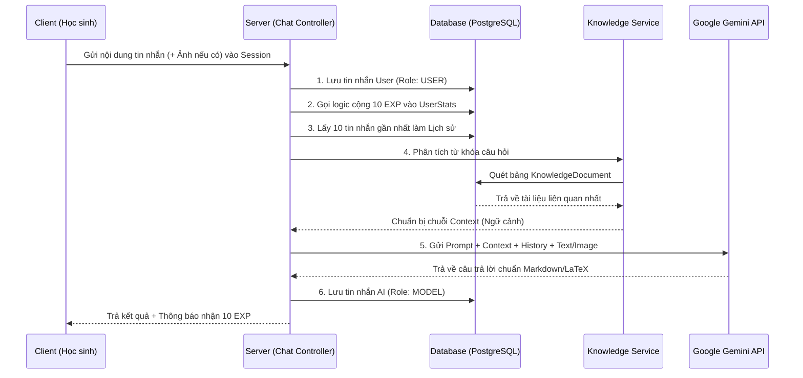

# Tài liệu Luồng Hoạt Động (Workflow) - Module Trợ Lý AI KHTN

Tài liệu này tóm tắt kiến trúc và toàn bộ luồng xử lý của hệ thống Trợ lý AI (Gia sư KHTN) sau khi đã được tích hợp thành công vào Server.

## 1. Tổng quan Kiến trúc

Module Trợ lý AI KHTN hoạt động dựa trên 3 khối chính được liên kết chặt chẽ với nhau:
- **Khối Quản trị (Admin/Teacher Layer):** Quản lý cấu hình (Prompt tính cách AI) và Nhập liệu tri thức (Knowledge Base).
- **Khối Xử lý logic Chat (Core Chat Layer):** Lưu trữ lịch sử tin nhắn, quản lý phiên chat, tự động thưởng EXP cho học sinh.
- **Khối AI Sinh tạo (Generative AI Layer):** Đóng gói ngữ cảnh (Context), Lịch sử và Câu hỏi để tương tác với API của Google Gemini.

---

## 2. Luồng hoạt động chi tiết

### A. Luồng Quản trị Cấu hình & Tri thức (Dành cho Admin/Giáo viên)

Để AI có thể trả lời linh hoạt mà không cần sửa code (Hardcode), hệ thống áp dụng cơ chế Cấu hình Động.

1. **Thay đổi tính cách/yêu cầu (Prompt Tuning):**
   - Admin truy cập trang quản trị, sửa đổi nội dung của biến `AI_SYSTEM_PROMPT`.
   - Lệnh gọi API `PUT /api/system/configs/AI_SYSTEM_PROMPT`.
   - Dữ liệu được lưu ngay lập tức vào bảng `SystemConfig`. Ở lần chat tiếp theo của học sinh, AI sẽ tự động "thay đổi tính cách" theo dữ liệu mới nhất.
2. **Nạp dữ liệu sách (Knowledge Base):**
   - Giáo viên import dữ liệu sách (VD: Sách Chân trời sáng tạo).
   - Dữ liệu gọi qua API `POST /api/knowledge`.
   - Hệ thống chia nhỏ và lưu vào bảng `KnowledgeDocument`.
   - Nhờ cờ `isActive`, Giáo viên có thể bật/tắt tạm thời các bài học mà không cần xóa.

### B. Luồng Tương tác Trợ lý (Dành cho Học sinh)

Khi học sinh mở giao diện Chat và bấm gửi một tin nhắn (Ví dụ: *"Năng lượng là gì?"*):

**Các xử lý đặc biệt trong luồng này:**
- **Thưởng EXP Tự động:** Ngay khi hệ thống ghi nhận có một câu hỏi gửi tới, Server gọi hàm `addXpForChat` cộng 10 EXP vào bảng `UserStats` và ghi lại hoạt động trong `XpLog`. Không cần chờ phản hồi của AI.
- **Giới hạn Lịch sử (Memory Window):** Server chỉ kéo 10 tin nhắn gần nhất từ bảng `ChatMessage`. Điều này giúp hệ thống không bị tràn bộ nhớ context của Gemini (tránh lỗi `RESOURCE_EXHAUSTED` hoặc tốn phí token oan uổng).
- **Hỗ trợ xử lý Ảnh:** Nếu client gửi kèm một ảnh dưới định dạng Base64, Server tự động bóc tách MIME type và đẩy vào `inlineData` của Gemini, sau đó tự động đổi model sang `gemini-1.5-flash-8b` để đọc ảnh tốc độ cao.

---

## 3. Các quyết định thiết kế cốt lõi

- **REST API vs WebSocket:**
  Module này hiện đang được thiết kế dạng **REST API** (gửi Request -> Chờ vài giây -> Nhận JSON response cục bộ). Thiết kế này dễ quản lý token, dễ lưu DB và phù hợp với giai đoạn đầu. Tương lai (khi có nhu cầu), chúng ta sẽ nâng cấp lên Streaming bằng Server-Sent Events (SSE).

- **RAG Đơn giản (Keyword-based Retrieval):**
  Hiện tại, cơ chế tìm kiếm tài liệu đang chia từ khóa cơ bản từ câu hỏi và tính điểm (score) bằng `includes()`. Thuật toán này rất nhẹ và không tốn phí lưu trữ Vector DB. 

- **Bảo vệ Hệ thống (Error Handling):**
  Trong service đã cài sẵn lớp bảo vệ bắt lỗi quota của Google. Nếu hết hạn mức sử dụng hoặc hệ thống Google GenAI lỗi, Server sẽ không văng lỗi sập ứng dụng mà sẽ nhẹ nhàng trả về câu *"Hệ thống AI đang quá tải, vui lòng thử lại sau"*. Cấu trúc Error Handling chuẩn đã được thiết lập qua `next(error)`.
